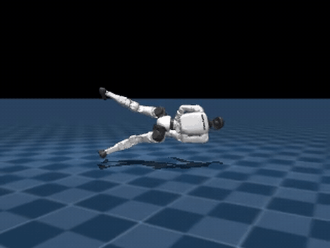
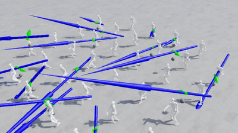
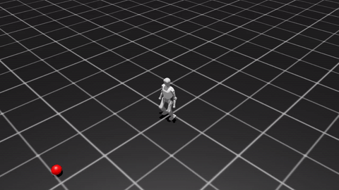
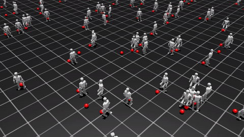

# ⚽ SoccerLab: A Full-Stack Humanoid Soccer Platform

**SoccerLab** is a full-stack humanoid soccer platform spanning **recovery → locomotion → atomic skills → multi-agent composition**. It runs on both [NVIDIA IsaacLab](https://github.com/isaac-sim/IsaacLab) (PhysX) and [mjlab](https://github.com/mujocolab/mjlab) (MuJoCo-Warp) backends, with a shared Finite State Machine (`fsmLab`) layer that composes learned skills into team-level play.

> This repo is under active development. Backend matrix: IsaacLab tasks live under `source/soccerTask/`; mjlab tasks under `source/soccer_tasks_mjlab/`.

## 🎬 Full-Stack Capabilities

From getting back up off the floor to scoring a goal — every layer of a soccer humanoid, in one repo.

| 🛟 Recovery | 🦶 Kicking (AMP) | ⚽ Dribbling — Train | 🎮 Dribbling — Play |
| :---: | :---: | :---: | :---: |
|  |  |  |  |
| Fall-recovery / standup policy on MuJoCo (G1) | Adversarial Motion Priors–guided kick skill, ported from [G1_kicking](https://github.com/Ethan-Li-k/G1_kicking) | RSL-RL PPO dribbling training, from [BackupDribbling](https://github.com/Ethan-Li-k/BackupDribbling) | Trained dribbling policy at play time |

> Locomotion (velocity tracking on flat / rough terrain) ships out-of-the-box via mjlab's bundled `Mjlab-Velocity-Flat-Unitree-G1` baseline.
>
> 📘 mjlab port details — install, asset choices, API mapping, upstream patches, smoke-train results — are in [`docs/mjlab_port.md`](docs/mjlab_port.md).

## 🌟 Key Features

  * **FSM-Driven Control:** Implement modular and robust high-level strategies through parallel state machines (`fsmLab`).
  * **Modular Skill Training:** Dedicated environments (Train Tasks) for mastering atomic skills such as locomotion, ball tracking, and precise shooting.
  * **Multi-Agent Environment:** Full support for team-based soccer scenarios (Battle Tasks) for cooperative and adversarial policy learning.
  * **IsaacLab Integration:** Leverages IsaacLab's high-fidelity physics simulation, asset management, and Reinforcement Learning (RL) tools.

## 📚 Project Structure and Design Philosophy

SoccerLab adheres to the IsaacLab extension structure, organizing its components logically:

| Path | Description | Based On/Purpose |
| :--- | :--- | :--- |
| `soccerLab/source/fsmLab` | **Control Core:** Implements the Parallel FSM logic for skill switching. | High-level strategy |
| `soccerLab/source/robotlib` | **Robot Configurations:** Defines robot specific physics, observation, and action parameters. | Configuration templates |
| `soccerLab/source/soccerTask` | **RL Tasks:** Contains both `train` (single skill) and `battle` (multi-agent) environments. | IsaacLab `TaskBase` |
| `soccerLab/data/assets/assetslib` | **Robot Assets:** Stores USD models, collision shapes, and inertial properties. | 3D Assets |
| `soccerLab/data/ckpts` | **Checkpoints:** Stores pre-trained policies and FSM strategy configurations. | Policy storage |

## 🔗 Dependencies and References

This repository is heavily inspired by, and in parts structurally adapted from, related dynamics and robotics research projects:

  * **Configuration Library:** [Renforce-Dynamics/robotlib](https://github.com/Renforce-Dynamics/robotlib)
  * **Asset Management:** [Renforce-Dynamics/assetslib](https://github.com/Renforce-Dynamics/assetslib)
  * **Utility & Tracking Components:** [Renforce-Dynamics/trackerLab](https://github.com/Renforce-Dynamics/trackerLab)
  * **Finite State Machine:** [Renforce-Dynamics/fsmLab](https://github.com/Renforce-Dynamics/fsmLab)

## 🛠️ Installation

**Prerequisite:** Ensure you have a functioning installation of [NVIDIA IsaacLab](https://www.google.com/search?q=https://github.com/NVIDIA-Omniverse/IsaacLab).

You can integrate **SoccerLab** into your IsaacLab environment using two primary methods:

### Method 1: Python Plugin Installation (Recommended)

This method installs **SoccerLab** as a Python package extension, which is typically cleaner for dependency management.

```bash
# Navigate to the SoccerLab directory
cd soccerLab
# Execute the setup script
./scripts/setup_ext.sh
```

### Method 2: Symbolic Linking to IsaacLab Source

This method is useful for active development, linking the repository directly into the IsaacLab source directory.

```bash
# Execute the linking script
python soccerLab/scripts/setup_isaaclab_link.py
```

### ⚙️ Setting up VSCode Code Completion

To ensure proper code intelligence and type hinting within your development environment, run the setup script for VSCode configuration:

```bash
python soccerLab/scripts/setup_vscode.py
```

## 🚀 Usage

### Training and Policy Deployment

The core functionalities for running simulations (training or playing pre-trained policies) are handled via dedicated scripts leveraging IsaacLab's backend.

| Action | Script | Description |
| :--- | :--- | :--- |
| **Training** | `soccerLab/scripts/factoryIsaac/train.py` | Starts the Reinforcement Learning process for a specified task (e.g., `locomotion`, `balls`). |
| **Playing** | `soccerLab/scripts/factoryIsaac/play.py` | Runs a simulation using a pre-trained policy checkpoint (from `data/ckpts/`) or the FSM controller. |

### Web Interface Deployment

To access and control the simulation via a web browser interface, please refer to the dedicated repository for the viewer implementation:

  * **Web Viewer:** [Renforce-Dynamics/labWebView](https://github.com/Renforce-Dynamics/labWebView)

### Real Robot Deployment (Sim-to-Real)

For deploying the trained FSM strategies onto a physical robot platform, consult the Sim-to-Real deployment guide:

  * **FSM Sim-to-Real:** [Renforce-Dynamics/FsmSimDeploy](https://github.com/Renforce-Dynamics/FsmSimDeploy)

## 🤝 Contributing

Contributions are welcome\! Please feel free to open issues or submit pull requests.